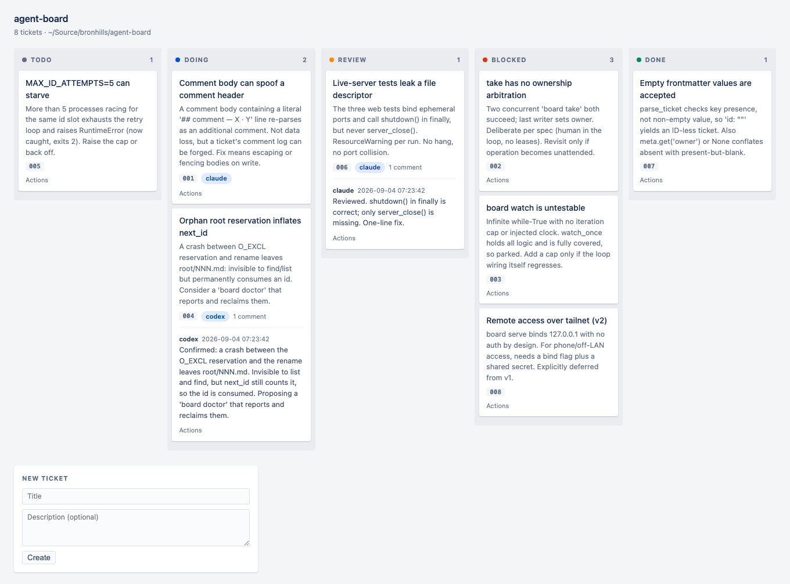

# agent-board

A file-backed kanban board for coordinating several coding agents with a human in
the loop. Directories are columns, tickets are markdown files, git is the history.

No dependencies. Python 3.11+.



## Install

```bash
git clone git@github.com:jharjadi/agent-board.git ~/Source/agent-board
ln -s ~/Source/agent-board/board /usr/local/bin/board
```

## Use

```bash
cd my-project
board init                              # creates .agent-board/
board new "Fix login redirect loop" --desc "401 doesn't clear the cookie"
board list
board take 1 --owner codex              # -> doing/
board comment 1 "Fixed in a1b2c3d" --by claude
board move 1 review
board assign 1 codex                    # advisory owner hint, no move
board serve                             # http://127.0.0.1:8899
```

Everything the CLI does, the web UI does too — create, move, assign, comment. The UI
is a projection over the filesystem: it owns no state, and a hard refresh rebuilds
the whole page from disk.

Editing `board.py` needs a `board serve` restart to take effect; the CLI picks up
changes immediately.

## Driving it with AI

`board init` appends a short block to the project's `AGENTS.md` and `CLAUDE.md`, so
agents discover the board on their own. That works the same whether the agent runs
in a terminal, a cmux pane, or a VS Code extension — they all read the project's
instruction files.

Which means you assign work in plain English:

> Take ticket 1 from the board. You're `codex`.

The agent runs `board show 1`, claims it with `board take 1 --owner codex`, does the
work, and reports with `board comment`. Nothing to explain, no inbox to check.

Hand it on the same way:

> Anything in review? You're `claude`.

That is the whole handoff. One agent moves a ticket to `review`, the next picks it
up from there — no relaying through you.

### Assignment is the column

Moving a ticket to `review` assigns it to whoever watches `review`. You never need
to know which agent that is today, or whether it is Claude or Codex or a person.

`board assign 7 codex` sets an **advisory** owner hint on top of that. The board
routes nothing and does not know which agents exist — it is a sticky note, and a
different agent picking the ticket up is fine.

This is deliberate. A board that knows about agents wants to know which are running,
which are free, and what to do when one dies. That is a scheduler, and a scheduler
made of LLM calls is what makes multi-agent setups expensive.

### Standing roles

Give an agent a column and leave it there:

> You are the reviewer. Watch `.agent-board/review/`. When a ticket appears, read it,
> review the branch named in its frontmatter, comment with `board comment`, then move
> it to `done` or `blocked`.

### Auto-nudge (optional)

So you never have to say "check the board":

```bash
board watch review | while read -r line; do
  cmux send --surface "$SURFACE" "Board changed: $line. Run: board list review"
  cmux send-key --surface "$SURFACE" Enter
done
```

Keep nudges content-free — the payload belongs in the ticket, which is inspectable
and version-controlled. An agent running with `--yolo` or
`--dangerously-skip-permissions` cannot tell injected keystrokes from the human
typing, so instructions must never travel over `cmux send`.

## Rules

- The **directory is the only truth**. There is no `status` field.
- The board carries coordination; **git carries code**. Diffs never go in tickets.
- Give each agent its own **git worktree** so they cannot corrupt each other.

## Known limitations

- **Watcher granularity.** `board watch` detects change by file mtime. Two edits landing within the same mtime tick are seen as one change, and because `os.replace` does not update mtime, a ticket that leaves a column and returns before the next poll is not re-flagged. Poll interval defaults to 5s.
- **No claim arbitration.** `board take` does not lock a ticket. Two agents taking the same ticket at the same moment will both succeed and the last writer sets the owner. This is deliberate — a human is in the loop and will notice — so there are no leases and no expiry.
- **Local only.** `board serve` binds `127.0.0.1` and has no authentication. Do not expose it to a network or a tailnet as-is.

## Design

See `docs/superpowers/specs/2026-09-04-agent-board-design.md`.
