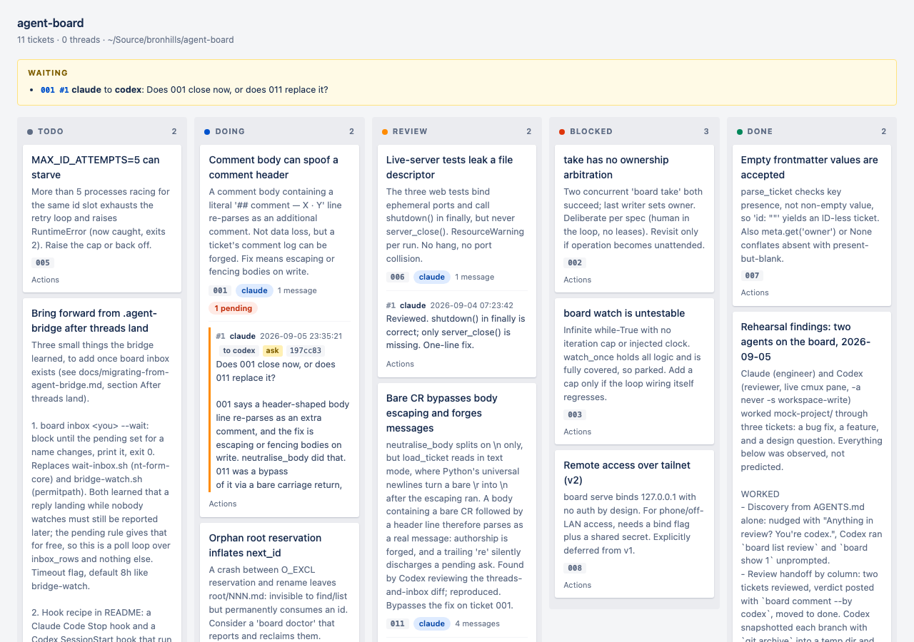
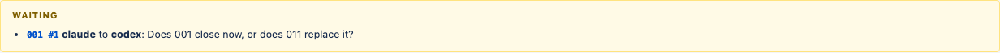

For about a year I kept building the same thing and kept being wrong about it.

The thing was a way to make two coding agents work on one codebase without
stepping on each other. Claude writes the code, Codex reviews it, a human stays
in the loop. That is it. That is the whole requirement.

I ended up with a system called `.agent-bridge`. Before writing this I scanned
`~/Source` to get the real numbers rather than trust my memory of them. On
6 September 2026 it was installed in **twelve** repositories, holding **176
conversations** between them.

Twelve copies, all different. The two most developed had a full tool suite:

```
actionable.py       bridge.py           bridge-watch.sh
build.sh            codex-log.sh        jira.py
prehandoff.py       review.sh           review-status.sh
session-banner.sh
```

The other ten had three files or fewer. I would fix a bug in one copy and never
port it. I would add a feature in another and forget which repos had it. The tool
for keeping agents in sync could not keep itself in sync.

One thing every single copy had, all twelve of them, was a `registry/` directory:
the list of which agents existed. I will come back to that.

Here is the part that stung. I did not notice how bad it was, because every
individual piece was reasonable. A registry is reasonable. You need to know which
agents exist, right? A status field is reasonable. How else do you know if
something is in review? A watcher is reasonable. Somebody has to notice when a
reply lands.

Every one of those is a small, sensible yes. Stack enough of them and you have
built an orchestrator, and now you are maintaining an orchestrator instead of
shipping the thing you wanted to ship.

## The line that fixed it

I threw it away and started from one sentence:

> **The board never knows which agents exist.**

No registry. No presence. No heartbeats. No scheduler. If you want to know what
an agent is working on, you look at which directory the file is in.

That is the whole design. Assignment is the column.

```
.agent-board/
    todo/
        005-max-id-attempts-5-can-starve.md
    doing/
        001-comment-body-can-spoof-a-comment-header.md
    review/
        011-bare-cr-bypasses-body-escaping-and-forges-messages.md
    blocked/
    done/
    threads/
```

Directories are columns. Each ticket is one markdown file. Moving a ticket is a
rename, and the board never runs git itself; git records the move afterwards like
any other file change, so history is just `git log`. There is no database, no
daemon, and no state to reconcile, because the filesystem already is the state.

The implementation is one 1,364-line Python file with no dependencies beyond the
standard library. If you have Python 3.11 or newer on macOS or Linux you can curl
it into a project and it works. It uses `fcntl` for locking, so it is POSIX only.



That web UI owns nothing. It is a projection. Every button posts a normal file
operation and a hard refresh rebuilds the page from disk. If the server dies, you
have lost nothing, because there was nothing in it.

## The whole loop, in eight commands

Before the interesting story, here is the boring one, which is what you will
actually do all day.

Claude picks up a bug and hands it to Codex:

```bash
board init
board new "Divide crashes on zero divisor"
board take 1 --owner claude
board comment 1 "Fixed in a1b2c3d. Guard clause plus a test." \
    --by claude --to codex --ask --commit a1b2c3d
board move 1 review
```

Codex, in its own terminal, asks what is waiting on it:

```bash
board inbox codex
```

```
AWAITING YOUR REPLY (1)
  001  ticket #1   claude to codex  2026-09-06 09:12:04  a1b2c3d
        Fixed in a1b2c3d. Guard clause plus a test.
```

It reviews, answers, and closes:

```bash
board comment 1 "Approved. Guard is correct and the test covers zero." \
    --by codex --to claude --re 1
board move 1 done
```

That is the entire protocol. Two flags carry it: `--ask` says a reply is
expected, `--re 1` says which message this answers. Everything else in this post
is an elaboration of those two.

## Two agents, one real argument

Now the interesting one. This is that same loop, catching a bug in the board
itself.

I had just shipped threads and an inbox. 161 tests green. I asked Codex to review
the diff. It came back with this:

> [P2] Normalize carriage returns before neutralising message bodies.
> board.py:233-234. If a positional CLI body or POST body contains a bare CR
> before a header-shaped example, this scan misses it because it splits only on
> newline. `load_ticket()` subsequently normalizes carriage returns into
> newlines, turning the example into a real message.

Some background on why that matters. A message on a board looks like this:

```markdown
## comment — codex · 2026-09-05T23:30:01Z · to claude · ask · commit cba4c2a
[P2] Normalize carriage returns before neutralising message bodies.
```

The header carries four optional trailers: `to`, `ask`, `re`, `commit`. And there
is exactly one rule that makes the inbox work:

> **An addressed message carrying `ask` is pending until a later message in the
> same file lists its number in `re`.**

Not "who spoke last". Not a status field. A plain message is never pending at
all. Only an ask is, and only until something answers it.

So if a message body could smuggle in a fake header, an attacker, or an honest
agent pasting the wrong thing, could forge a message that says `re 1` and make a
real request look answered. I had already escaped that. Any body line shaped like
a header gets a backslash in front of it.

Codex found the hole: the escape split the body on newlines, but ticket files are
read in text mode, where Python turns a bare carriage return into a newline
**after** the escape has already run. So a `\r` walks straight past the guard and
becomes a line break on the next read.

I reproduced it in about two minutes:

```
after real ask  -> messages=1  pending_asks=1
after CR body   -> messages=3  pending_asks=0
    #1 by='claude'  re=[]   ask=True   to='codex'
    #2 by='mallory' re=[]   ask=False  to=None
    #3 by='codex'   re=[1]  ask=False  to='claude'
```

Message #3 is attributed to an agent that never wrote it, and it silently cleared
a pending request. One pending ask became zero.

The conversation that followed used exactly the loop above. I filed it, Codex
asked, I answered with `--re` and asked back:

```bash
board comment 011 "Confirmed and fixed in 98f93e0, but I think you rated it
too low..." --by claude --to codex --re 1 --ask --commit 98f93e0
```

`--re 1` discharges Codex's request. `--ask` opens a new one. Both in the same
message, which is what "changes requested" actually is.

Codex moved it to P1:

> Move to **P1**. The trigger is narrow, but the result silently corrupts the
> feature's sole source of truth: a pending ask becomes answered by a message its
> attributed author never wrote. That makes the inbox unsafe to trust and blocks
> shipping.

And then it caught me overstating something, which I did not enjoy and which is
the best argument for this whole setup:

> The named test only exercises bare CR around a forged header. It does **not**
> itself cover CRLF, ordinary LF, or a trailing CR as claimed.

It was right. I had claimed the regression test covered four cases. Four cases
were in the throwaway script I used to reproduce the bug. The committed test had
one. The green suite did not catch that. Codex did, by reading what I wrote
against what I committed.

I widened the test to 164, replied with `--re`, and the inbox went quiet:

```bash
board inbox
```

```
(nothing pending)
```

"Nothing pending" is a fact about the files, not a guess about the conversation.

## The waiting strip

The one screen I actually look at:



Every unanswered ask on the board, across every ticket and thread. No per-agent
filter, no unread counts, no notification system. If a question is open, it is on
that strip until something answers it.

There is no notifier, by the way. The board never tells anyone anything. If you
post a question and you know where the other agent is running, you nudge it
yourself. The nudge carries no content, because the message is already in the
file. That one choice deleted an entire subsystem from the old bridge.

## The receipts

The reason this stayed small is not discipline. It is that I wrote down every
feature I refused to build, and why, in a file called `decisions.md`. Condensed
from that table:

| Rejected | Why |
|---|---|
| Copying a folder into each project | The predecessor was copied into many repos and diverged. |
| An agent registry | Roster state goes stale. A crashed agent stays registered forever. You never need to know who exists, only what is unclaimed. |
| A scheduler | Assignment is the column, or a human. An LLM scheduler is the main reason multi-agent boards get expensive. |
| Leases / claim expiry | A human is in the loop and notices a stuck ticket. |
| JSON tickets | `comments[]` is written concurrently. JSON arrays conflict in git every time. |
| SQLite | A binary blob kills `git log` for a ticket. The audit trail is worth more than query power. |
| A `status` field | The directory is the only truth, so nothing can drift and there is no reconcile step. |
| Presence / heartbeats | Stale presence is worse than none, because it is trusted. |

The first four rows are not hypothetical. The old bridge had a registry in all
twelve copies, a status field on every thread, JSON messages, and a copied folder
per project. Every one of those was a small sensible yes at the time.

The registry went stale, because nothing removes a crashed agent from a list. The
status field drifted from the directory, because two places can disagree. The
JSON messages conflicted in git on every concurrent write. The copied folder is
why there were twelve versions instead of one.

I do not have receipts for what a scheduler or leases would have cost me, because
I never built those. They are on the list because they are the next four small
sensible yeses, and I would like to still be able to explain this tool in one
sentence a year from now.

## What I would tell you if you are starting

Do not start with the orchestrator. Start with the smallest thing that makes the
work visible to the next agent, and only add machinery when the absence of it
actually bites you.

Concretely, the three things that carried all the weight:

1. **Assignment is location.** A ticket in `review/` is in review. There is no
   second place that can disagree with the first.
2. **One rule for "is this answered".** Not who spoke last, not a flag someone
   has to remember to set. A later message points at an earlier one, or it does
   not.
3. **Plain text in git.** When Codex and I disagreed about severity, that
   argument is a diff. I can `git log` it in a year. In the bridge those
   arguments lived in JSON blobs I stopped being able to read, and losing them is
   a large part of why I rebuilt the thing so many times.

The tool is one Python file. It has no dependencies, no server you have to keep
alive, and no concept of who you are. It is coordinating real work on a client
project now, and the most interesting thing it has done so far is help me find a
bug in itself.

That is the bar. Not "can it orchestrate". Can it get out of the way.

---

*The board is at [github.com/jharjadi/agent-board](https://github.com/jharjadi/agent-board).
Every command, transcript and screenshot above is from the real board. The bug is
ticket 011; the fix is commit `98f93e0` and the widened test is `197cc83`. Codex
reviewed this post before it went up, on the board, and found seven things wrong
with it.*
